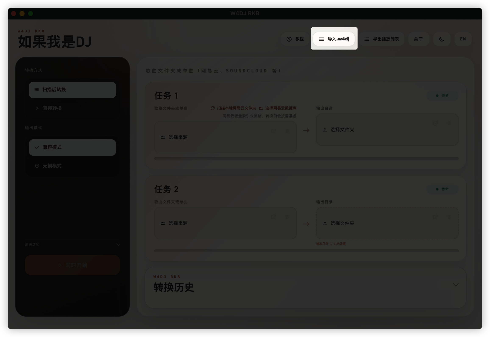
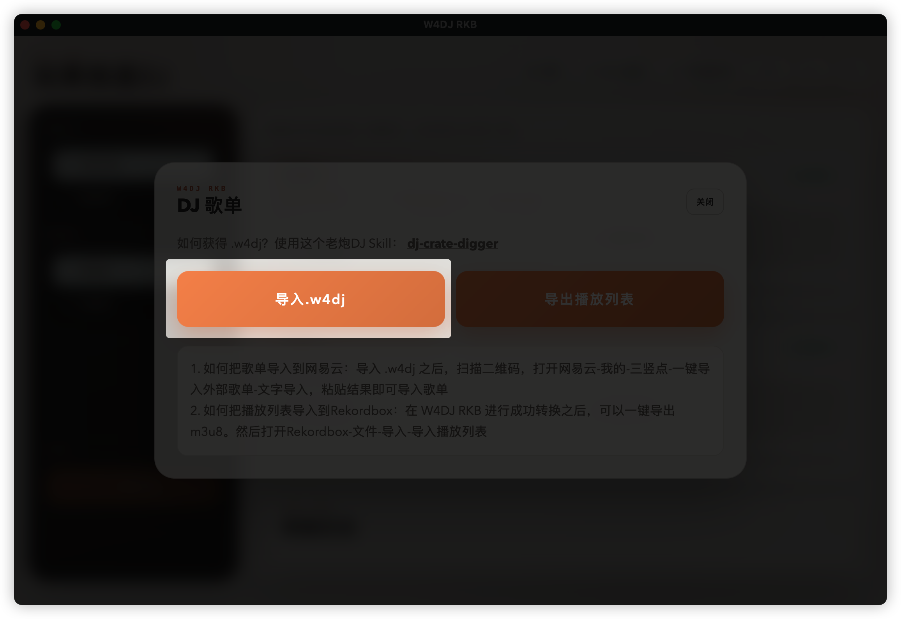
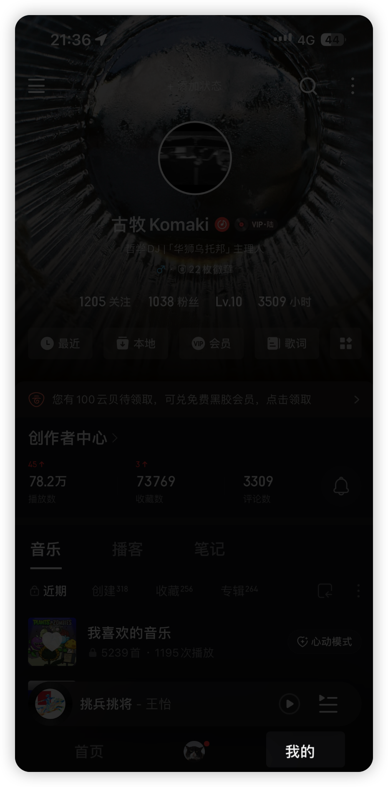
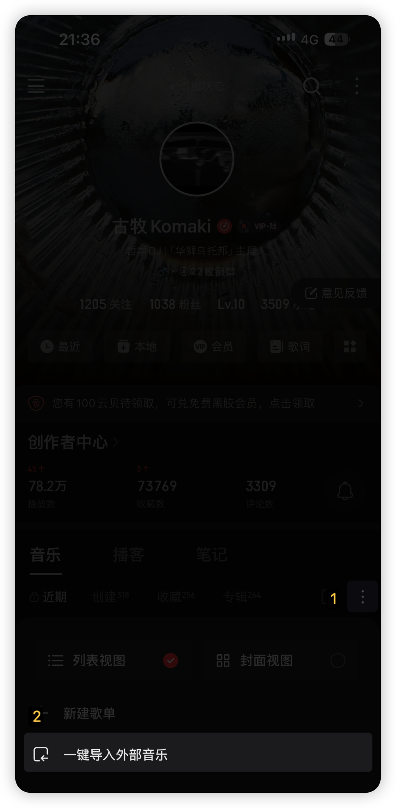
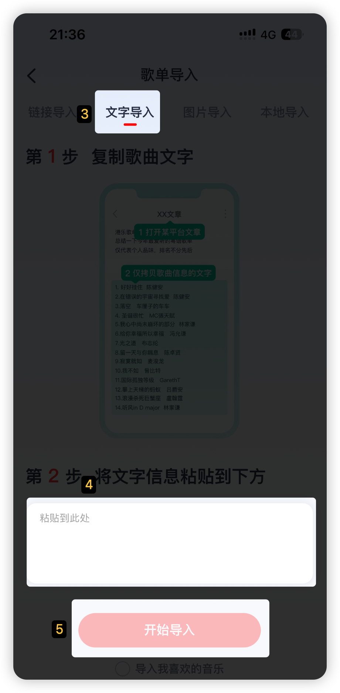
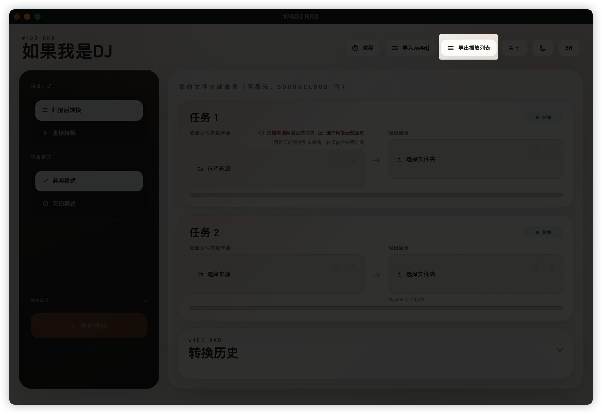
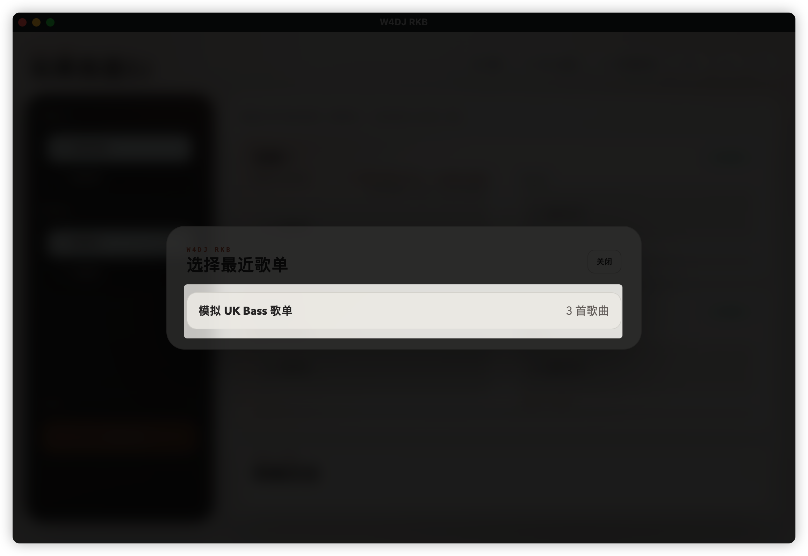
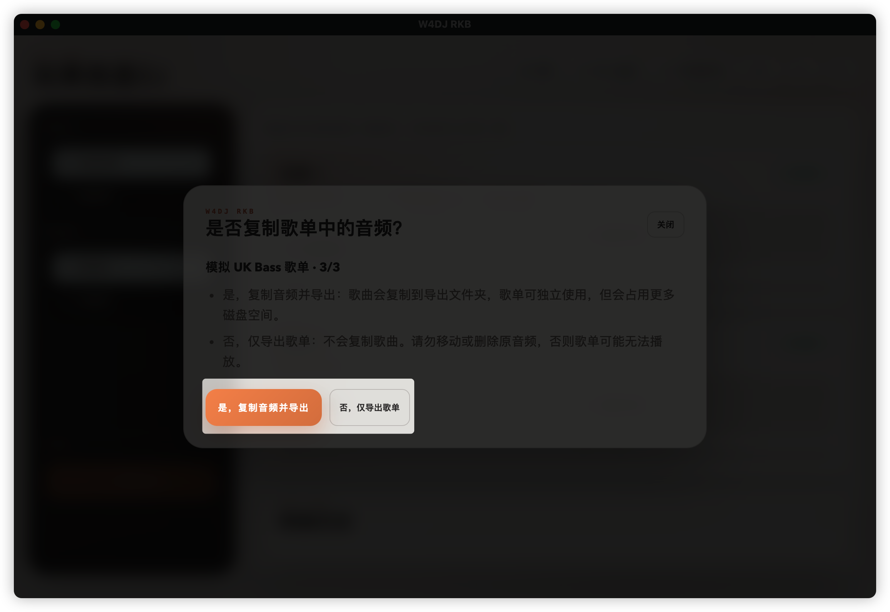
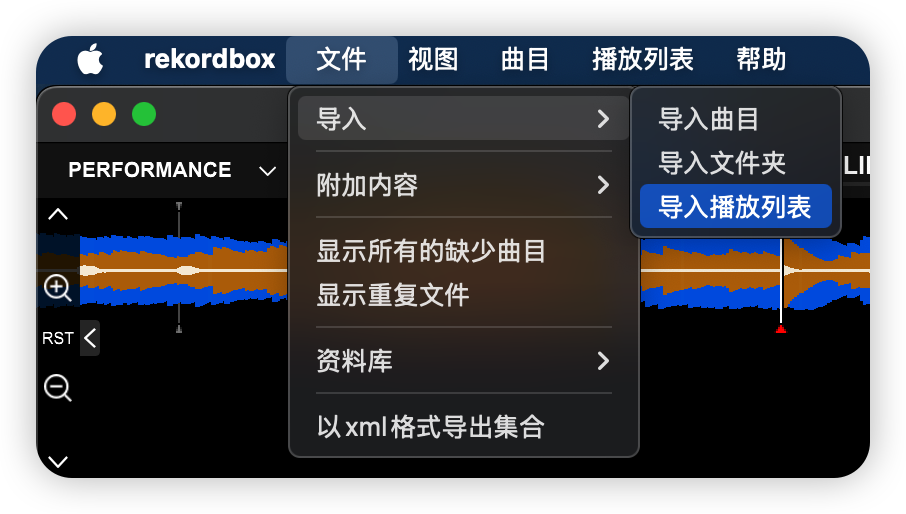
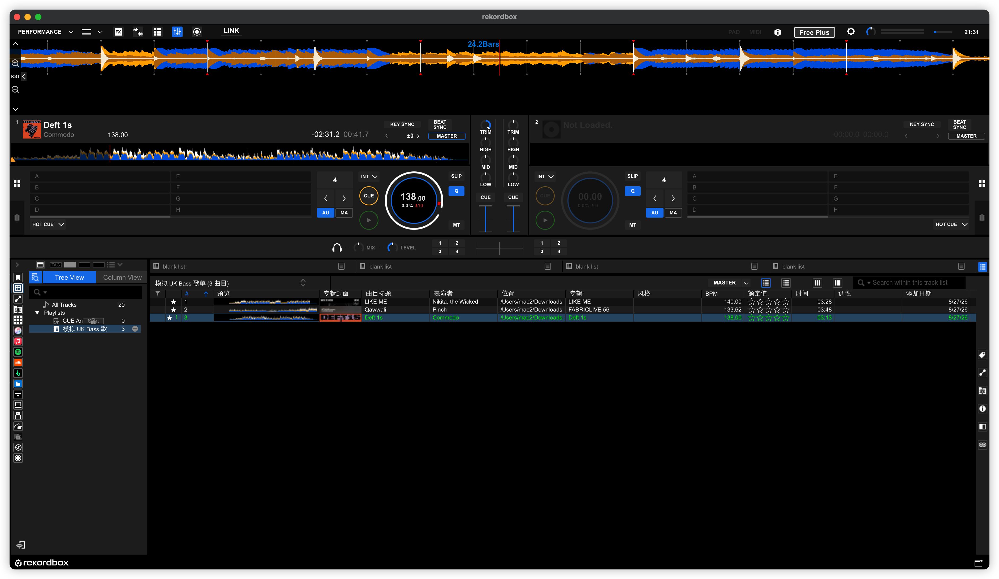

# [老炮DJ](https://github.com/komakizhu/dj-crate-digger) skill与.w4dj交接教程，一键下载set并导入RKB

[中文](README.md) | [English](README.en.md)

`.w4dj` 是 [老炮DJ](https://github.com/komakizhu/dj-crate-digger) 与 [W4DJ RKB](https://github.com/komakizhu/W4DJ-RKB) 之间的歌单交接文件。它保存歌单名称、曲目顺序、完整官方歌名和艺人信息，但不包含歌曲音频。

文件内部始终使用固定的 `format_version: 2` 兼容值。这是给 W4DJ RKB 识别文件用的机器字段，用户不需要选版本，也不需要手动填写。

完整流程是：

[老炮DJ](https://github.com/komakizhu/dj-crate-digger) 生成歌单 → 导出 `.w4dj` → 导入 W4DJ RKB → 在网易云音乐创建歌单并下载歌曲 → W4DJ RKB 转换音频并导出播放列表 → 导入 Rekordbox。

> `.w4dj` 不是音频文件，也不能直接导入 Rekordbox。W4DJ RKB 不会替用户获取版权音频；歌曲必须先通过合法渠道下载到本地。

## 第一步：从 [老炮DJ](https://github.com/komakizhu/dj-crate-digger) 获得 `.w4dj`

完成选歌后，直接回复：

```text
导出到w4dj
```

[老炮DJ](https://github.com/komakizhu/dj-crate-digger) 会生成一个以 `.w4dj` 结尾的文件。请将它保存到本地。

## 第二步：下载 W4DJ RKB

前往 [W4DJ-RKB](https://github.com/komakizhu/W4DJ-RKB) 下载并安装适合当前系统的版本。

打开 W4DJ RKB 后，点击页面右上方的「导入 .w4dj」。



在弹出的「DJ 歌单」窗口中再次点击「导入 .w4dj」，然后选择刚才保存的文件。



导入成功后，W4DJ RKB 会读取歌单名称、曲目顺序和歌曲信息。`.w4dj` 不包含歌曲级网易云 ID；它只提供完整歌名、全部歌手、版本信息和歌单顺序，供后续文字匹配使用。

## 第三步：把歌单导入网易云音乐

当前已验证的操作路径为手机版网易云音乐。不同版本的按钮位置或名称可能略有变化。

### 1. 获取文字版歌单

导入 `.w4dj` 后，按照 W4DJ RKB 中的提示：

1. 打开二维码；
2. 使用手机扫描二维码；
3. 复制页面中生成的文字版歌单。

文字版歌单通常包含歌曲名称和艺人名称，用于网易云音乐自动匹配。

> W4DJ RKB 的文字导入和后续本地整理使用歌曲标题、全部艺人和版本信息进行交接。DJ Skill 不搜索或猜测网易云歌曲 ID；用户实际选中的网易云记录和实际输出文件由下游流程登记。

### 2. 打开网易云音乐的「我的」

打开手机版网易云音乐，点击底部导航栏中的「我的」。



### 3. 打开右上角菜单

在「我的」页面中点击右上角的三个点 `⋮`。

> 注意：这里是右上角的三个点，不是左上角的菜单按钮。

### 4. 选择「一键导入外部音乐」

在弹出的菜单中点击「一键导入外部音乐」。



### 5. 切换到「文字导入」

进入「歌单导入」页面后，选择顶部的「文字导入」。



### 6. 粘贴文字并开始导入

把从 W4DJ RKB 复制的文字版歌单粘贴到输入框，然后点击「开始导入」。

粘贴前建议确认：

- 每首歌包含歌名和艺人；
- 每首歌单独占一行；
- 不要删除 Remix、Dub、Edit、Live、Radio Edit 或 Extended Mix 等版本限定；
- 不要额外加入与歌曲无关的说明文字。

### 7. 检查匹配结果并下载

网易云音乐会根据歌名和艺人自动匹配歌曲。匹配完成后，请逐首检查：

- 歌名和艺人是否正确；
- 是否匹配到正确的 Remix、Dub、Edit 或 Extended Mix；
- 是否出现同名但不同版本的歌曲；
- 是否有歌曲因版权或地区原因没有匹配成功。

确认无误后创建歌单，并把需要用于 DJ 软件的歌曲下载到本地。

> 网易云音乐的自动匹配不保证版本完全正确，下载前仍需人工核对。

## 第四步：在 W4DJ RKB 中转换歌曲

歌曲下载完成后，返回 W4DJ RKB：

1. 选择网易云音乐的歌曲文件夹或需要处理的单曲；
2. 选择转换后的输出目录；
3. 根据需要选择转换方式和输出模式；
4. 开始扫描与转换；
5. 等待任务完成，并确认歌单中的歌曲均已找到。

如果部分歌曲没有找到，请先检查网易云音乐是否已经完成下载，以及下载的版本是否与歌单中的完整官方歌名一致。W4DJ RKB 在此阶段根据完整标题、全部艺人、版本信息和操作上下文建立“歌单位置 → 实际输出文件”的绑定；DJ Skill 不参与这一步，也不通过猜测歌曲 ID 来掩盖错误匹配。

## 第五步：导出播放列表

转换完成后，点击 W4DJ RKB 顶部的「导出播放列表」。



在弹窗中选择需要导出的歌单。



随后选择导出方式。



### 复制音频并导出

歌曲会被复制到新的导出文件夹，并同时生成播放列表。这种方式适合移动到另一台电脑，或者希望音频和播放列表放在同一目录的情况，但会占用更多磁盘空间。

### 仅导出歌单

只生成播放列表，不复制歌曲音频。这种方式不会产生重复音频文件，但导出后不要移动、重命名或删除原始音频，否则 Rekordbox 可能无法找到歌曲。

## 第六步：导入 Rekordbox

打开 Rekordbox，依次选择：

```text
文件 → 导入 → 导入播放列表
```



选择 W4DJ RKB 导出的 `.m3u8` 播放列表。导入成功后，Rekordbox 左侧的播放列表区域会出现对应歌单，曲目顺序与 `.w4dj` 中的顺序保持一致。



## 常见问题

### `.w4dj` 能直接导入 Rekordbox 吗？

不能。必须先用 W4DJ RKB 读取 `.w4dj`、准备本地音频并导出 `.m3u8`，再把 `.m3u8` 导入 Rekordbox。

### 为什么 Rekordbox 导入后没有歌曲？

常见原因包括：

- 本地音频尚未下载或转换完成；
- 播放列表中的音频路径已经失效；
- 导出后移动或重命名了歌曲；
- 选择了「仅导出歌单」，但原始音频已经不在原位置；
- Rekordbox 没有权限读取歌曲所在目录。

如果无法确定原因，建议重新选择「复制音频并导出」。

### 导入的歌曲版本不对怎么办？

请先检查网易云音乐匹配到的曲目是否为正确版本，例如 Original、Remix、Dub、Edit 或 Extended Mix。`.w4dj` 会保留完整官方歌名，但平台的自动匹配结果仍需人工确认。

### W4DJ RKB 会自动下载歌曲吗？

不会替用户获取音频。用户需要先通过合法渠道下载或准备本地歌曲文件，W4DJ RKB 负责识别、转换、整理并导出播放列表。
